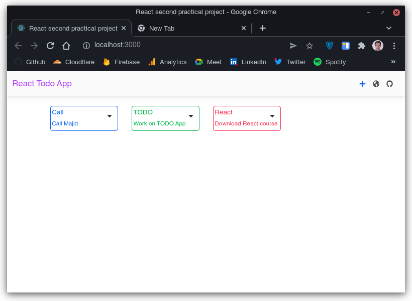
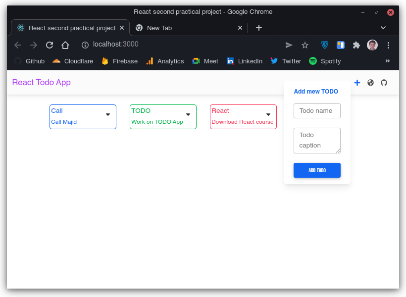
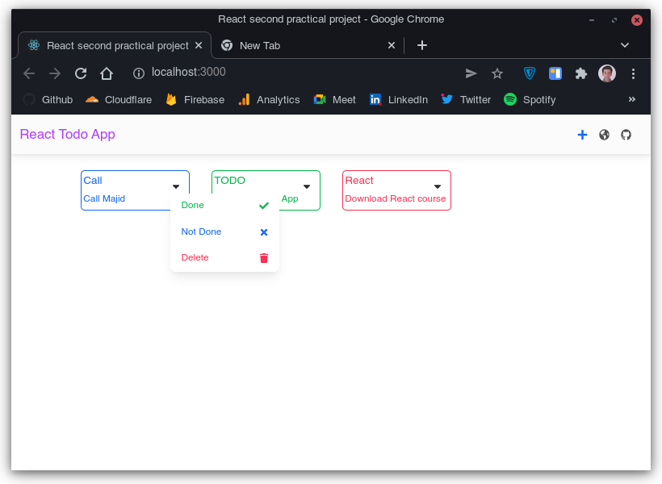

# Second React practical project

This is the second React practical project. In summary. it's a simple TODO application.

[First practical project](https://github.com/BlackIQ/React-Practical-1) is a shopping card. Simple project.

### What is this app

As you read before, this is a sample TODO app. TODOs divide in 3 categories.

- **Not done** category with blue color
- **Done** category with green color
- **Deleted** category with red color

Each todo is in a box that contains **Name** and **Caption**.

### Previews





### Dropdowns

All dropdowns have 3 items:

- Done
- Not done
- Trash

When you open a dropdown, if status of todo is **done**, done will be **disabled**.
Same for others. It todo is deleted, the **trash** item will be also disabled.

### How to run?

Clone and run it.

```shell
$ git clone https://github.com/BlackIQ/React-Practical-1
$ npm run
```

### Notice

**App is not completed yet.**